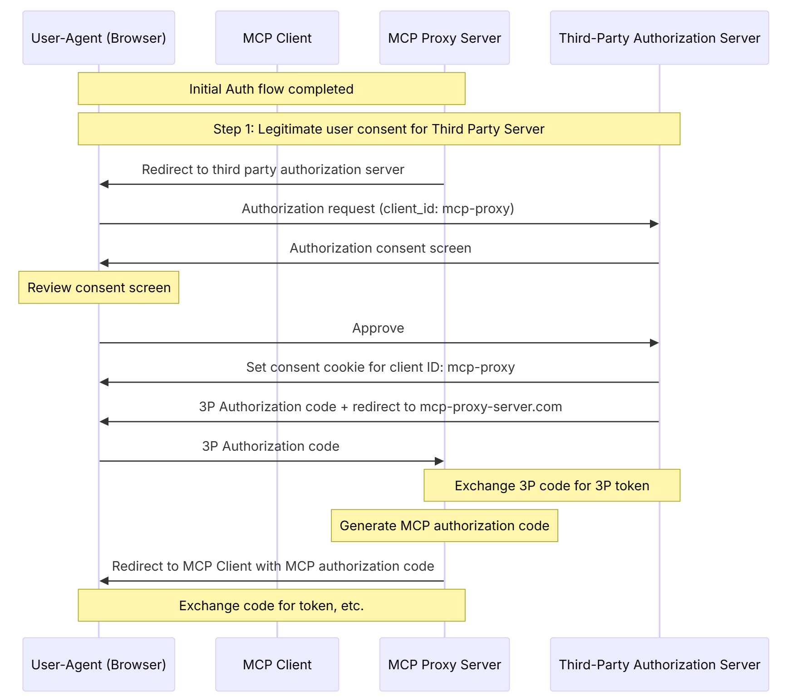

<div align="center">
  <a href="https://fctr.io">
    
  </a>
</div>

<div align="center">
  <h2>Okta MCP Server with OAuth 2.1 & RBAC</h2>
  <h3>🔐 Enterprise-Grade Security for Model Context Protocol</h3>
  <h4>🚧 BETA v0.2.0 - OAuth Proxy Implementation</h4>
</div>

<div align="center">
A  MCP server that enables AI models to securely interact with Okta environments through OAuth 2.1 authentication and Role-Based Access Control (RBAC). This implementation follows the legacy MCP specification (03-26) where the MCP server acts as an OAuth proxy between AI clients and Okta.
</div>

<div align="center">
<p><a href="https://github.com/fctr-id/okta-mcp-server/tree/feature/oauth-proxy-implementation">View on GitHub</a> | <a href="https://modelcontextprotocol.io/introduction">Learn about MCP</a> | <a href="https://aaronparecki.com/2025/04/03/15/oauth-for-model-context-protocol">OAuth for MCP</a></p>
</div>

<div align="center">
<h3>MCP Oauth Proxy Flow Architecture</h3>
<p>
  
</p>
</div>

## 📋 Table of Contents

- [🚀 Quick Start](#-quick-start)
- [🔍 Why OAuth Proxy?](#-why-oauth-proxy)
- [🏗️ Okta Configuration](#️-okta-configuration)
- [⚙️ Environment Setup](#️-environment-setup)
- [🖥️ Running the Server](#️-running-the-server)
- [🐳 Docker Deployment](#-docker-deployment)
- [🔧 MCP Client Configuration](#-mcp-client-configuration)
- [🛠️ Available Tools & RBAC](#️-available-tools--rbac)
- [⚠️ Security Considerations](#️-security-considerations)
- [🆘 Support](#-support)

## 🚀 Quick Start

Get up and running in 5 minutes:

```bash
# 1. Clone the OAuth proxy implementation branch
git clone -b feature/oauth-proxy-implementation https://github.com/fctr-id/okta-mcp-server
cd okta-mcp-server

# 2. Install dependencies
pip install -r requirements.txt

# 3. Configure environment
cp .env.sample .env
# Edit .env with your Okta configuration

# 4. Start the server
python -m okta_mcp.oauth_proxy.server --host localhost --port 3001
```

Your MCP server will be available at: `http://localhost:3001/mcp`

## 🔍 Why OAuth Proxy?

This server implements the **legacy MCP specification (03-26)** where authentication and authorization are handled server-side through an OAuth proxy pattern. This approach provides several advantages:

### 🔒 **Enhanced Security**
- **No client-side secrets**: All OAuth credentials remain on the server
- **Centralized authentication**: Single point of authentication control
- **RBAC enforcement**: Role-based access control at the server level
- **Audit trails**: Complete logging of all access attempts

### 🏢 **Enterprise-Ready**
- **Okta integration**: Native support for enterprise identity providers
- **Group-based permissions**: Map Okta groups to tool access levels
- **Session management**: Secure session handling with automatic refresh
- **Production deployment**: Docker support and environment isolation

### 🌐 **Universal Client Support**
- **Web-based auth**: Works with any MCP client (VS Code, Claude Desktop, web apps)
- **Simple client setup**: Clients only need the MCP server URL
- **No client configuration**: No need to distribute OAuth credentials

### 🚀 **Future Evolution**
This BETA v0.10 implementation demonstrates the OAuth proxy pattern described in our [security blog post](docs/BUSINESS_BLOG_POST_OAUTH_SECURITY.md). **Dynamic Client Registration (DCR)** support following the newer MCP specification (06-18) is planned for future releases, which will provide distributed authentication and reduced server load.

For comparison between OAuth proxy and DCR approaches, see [Aaron Parecki's OAuth for MCP article](https://aaronparecki.com/2025/04/03/15/oauth-for-model-context-protocol).

## 🏗️ Okta Configuration

### 1. Create OAuth Application

In your Okta Admin Console:

1. Go to **Applications** → **Create App Integration**
2. Choose **Web Application**
3. Configure the application:
   - **App integration name**: `MCP Server`
   - **Sign-in redirect URI**: `http://localhost:3001/oauth/callback`
   - **Sign-out redirect URI**: `http://localhost:3001/oauth/logout` (change these as needed if deployed somewhere else)
   - **Grant types**: Authorization Code, Refresh Token, Client Credentials, Enable PKCE
   - **Assignments**: Assign to appropriate groups (groups claims as groups)

4. Note the **Client ID** and **Client Secret** for your `.env` file

### 2. Configure Required Scopes

Your OIDC application needs specific Okta API scopes. In the application settings:

1. **API Scopes** (add these to your application):
   ```
   openid
   profile
   email
   offline_access
   groups
   okta.users.read
   okta.groups.read
   okta.apps.read
   okta.events.read
   okta.logs.read
   okta.policies.read
   okta.devices.read
   okta.factors.read
   ```

### 3. Create Okta Groups for RBAC

Create groups in Okta to map to different access levels:

- **sso-super-admins** → Super Admin (full access)
- **sso-security-admins** → Security Admin (user/group management)
- **sso-help-desk** → Viewer (read-only access)

### 4. Generate API Token

1. Go to **Security** → **API** → **Tokens**
2. Create a token with **Read-Admin** permissions
3. Restrict the token to younr network 
4. Note the token for your `.env` file

## ⚙️ Environment Setup

Copy the sample environment file and configure your settings:

```bash
cp .env.sample .env
```

### Required Configuration

```bash
# Okta Organization
OKTA_ORG_URL=https://your-org.okta.com
OKTA_API_TOKEN=your-api-token

# OAuth Application
OKTA_CLIENT_ID=your-oauth-client-id
OKTA_CLIENT_SECRET=your-oauth-client-secret
OKTA_OAUTH_AUDIENCE=fctrid-okta-mcp-server
OAUTH_REDIRECT_URI=http://localhost:3001/oauth/callback
OAUTH_REQUIRE_HTTPS=false

# RBAC Group Mappings
GROUP_TO_ROLE_SUPER_ADMIN="IT Administrators"
GROUP_TO_ROLE_SECURITY_ADMIN="Security Team"
GROUP_TO_ROLE_VIEWER="Help Desk,All Users"
```

### Optional Configuration

```bash
# Logging and Performance
LOG_LEVEL=INFO
OKTA_CONCURRENT_LIMIT=15
```

## 🖥️ Running the Server

### Python Development

```bash
# Start the OAuth proxy server
python -m okta_mcp.oauth_proxy.server --host localhost --port 3001

# The server will be available at:
# - MCP endpoint: http://localhost:3001/mcp
# - OAuth login: http://localhost:3001/oauth/login
# - Health check: http://localhost:3001/health
```

## 🐳 Docker Deployment

### Build

```bash
# Build the Docker image
docker build -t okta-mcp-server .
```


## 🔧 MCP Client Configuration

### Universal MCP URL

All MCP clients use the same server URL:

```
http://localhost:3001/mcp
```

### VS Code Extension

In VS Code settings or `settings.json`:

```json
{
      "my-mcp-server-d3d8b476": {
        "url": "http://localhost:3001/mcp"
      }
}
```

### Claude Desktop  or Claude ai(for pro or above users)

Just add an integration pointing ot he URL the MCP server is deployed to: http://URL/mmcp
```

### Web Applications

```javascript
// JavaScript MCP client
const mcpClient = new MCPClient({
  serverUrl: 'http://localhost:3001/mcp'
});
```

### Authentication Flow

1. Client connects to MCP server URL
2. Server redirects to OAuth login page
3. User authenticates with Okta
4. Server establishes authenticated session
5. Client receives available tools based on user's role

## 🛠️ Available Tools & RBAC

### Role-Based Access Control

| Role | Tools Available | Description |
|------|-----------------|-------------|
| **Super Admin** | All 18 tools | Full Okta administration |
| **Security Admin** | 17 tools | User/group management, no policy changes |
| **Viewer** | 12 tools | Read-only access to users, groups, applications |

### Tool Categories

#### 👥 **User Management**
- `get_okta_user` - Get user details
- `list_okta_users` - List users with filtering
- `list_okta_user_groups` - Get user's group memberships
- `list_okta_user_applications` - Get user's app assignments
- `list_okta_user_factors` - Get user's MFA factors

#### 🏢 **Group Management**
- `get_okta_group` - Get group details
- `list_okta_groups` - List groups with filtering
- `list_okta_group_users` - Get group members

#### 📱 **Application Management**
- `get_okta_application` - Get application details
- `list_okta_applications` - List applications
- `list_okta_application_users` - Get app user assignments
- `list_okta_application_groups` - Get app group assignments

#### 📊 **Logging & Analytics**
- `get_okta_event_logs` - Query system logs
- `get_current_time` - Get current timestamp
- `parse_relative_time` - Parse time expressions

#### 🔐 **Security & Policies** *(Super Admin only)*
- `list_okta_policy_rules` - List policy rules
- `get_okta_policy_rule` - Get policy rule details
- `list_okta_network_zones` - List network zones

## ⚠️ Security Considerations

### Production Security

- **HTTPS Required**: Set `OAUTH_REQUIRE_HTTPS=true` for production
- **Secure Sessions**: Generate a strong `SESSION_SECRET_KEY`
- **Network Security**: Use firewalls and VPNs to restrict access
- **Rate Limiting**: Configure `OKTA_CONCURRENT_LIMIT` based on your Okta limits

### RBAC Best Practices

- **Principle of Least Privilege**: Only grant necessary group memberships
- **Regular Audits**: Review group mappings and user assignments
- **Monitoring**: Enable logging and monitor for suspicious activity

### Security Resources

- [OAuth for MCP Security Implementation](docs/BUSINESS_BLOG_POST_OAUTH_SECURITY.md)
- [Security Best Practices](docs/Security-Best-Practices.md)
- [Security Implementation Guide](docs/security-implementation.md)
- [Aaron Parecki's OAuth for MCP Security Model](https://aaronparecki.com/2025/04/03/15/oauth-for-model-context-protocol)
- [MCP Specification Security Considerations](https://modelcontextprotocol.io/specification/2025-06-18/basic/security_best_practices)

## 🆘 Support

### Documentation

- [Architecture Overview](docs/ARCHITECTURE_OVERVIEW.md)
- [Security Implementation](docs/security-implementation.md)
- [Examples](examples/)

### Community & Issues

- [GitHub Issues](https://github.com/fctr-id/okta-mcp-server/issues)
- [GitHub Discussions](https://github.com/fctr-id/okta-mcp-server/discussions)

### Enterprise Support

For enterprise deployments and custom implementations:
- Email: support@fctr.io
- Website: [fctr.io](https://fctr.io)

---

<div align="center">
  <p>Built with ❤️ by <a href="https://fctr.io">fctr.io</a></p>
  <p>Licensed under MIT | <a href="LICENSE">View License</a></p>
</div>