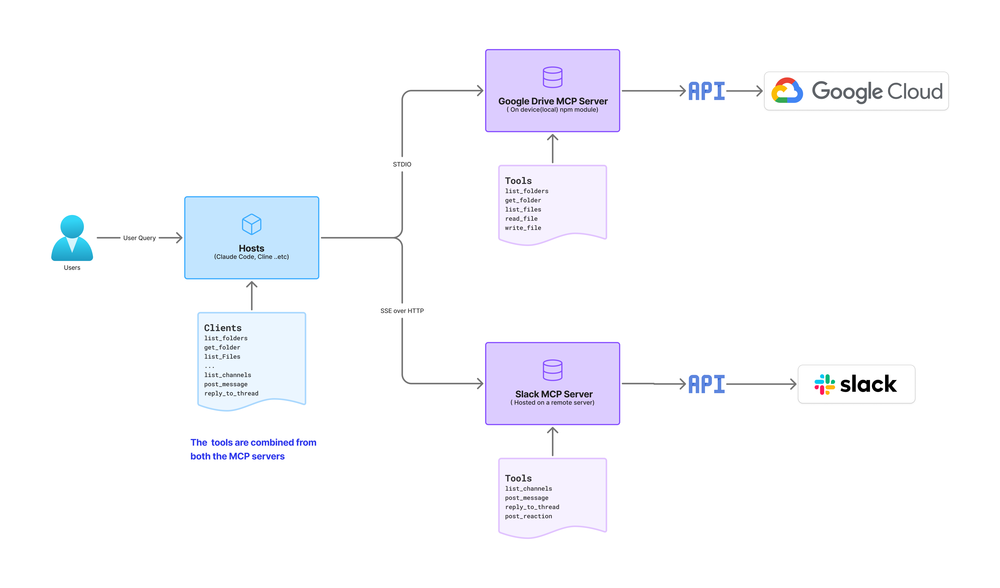

<div align="center">
  <a href="https://fctr.io">
    
  </a>
</div>

<div align="center">
  <h2>Okta MCP Server (v0.2.0-BETA)</h2>
</div>

<div align="center">
  <h3> **🚀 NEW in v0.2.0:** **Major Upgrade with OAuth and RBAC!**</h3>
</div>

<div align="center">
The Okta MCP Server is a groundbreaking tool that enables AI models to interact directly with your Okta environment using the Model Context Protocol (MCP). Built specifically for IAM engineers, security teams, and Okta administrators, it implements the MCP specification to transform how AI assistants can help manage and analyze Okta resources.
</div>

<div align= "center" >
<p ><a href="https://github.com/fctr-id/okta-mcp-server">View on GitHub</a> | <a href="https://modelcontextprotocol.io/introduction">Learn about MCP</a> | <a href="https://github.com/fctr-id/okta-ai-agent">Okta AI Agent</a></p>
</div>

<div align="center">
<h3>Quick Demo</h3>
<p >
  
</p>
</div>

## 🎉 What's New in v0.2.0-BETA - OAuth & RBAC Enterprise Security!

This release introduces **enterprise-grade security features** with these key improvements:

### 🔐 **OAuth 2.0 Authentication**
- **🌐 Web-Based Access**: Complete OAuth 2.0/OIDC flow with Okta integration
- **🛡️ Secure Sessions**: PKCE-enabled OAuth with encrypted session management
- **📱 Modern UI**: Web interface for OAuth consent and user authentication
- **🔗 Universal Access**: Works with web applications, browsers, and OAuth-compatible clients

### 🏢 **Role-Based Access Control (RBAC)**
- **� Group Mapping**: Automatic role assignment based on Okta group membership
- **� Tool Filtering**: Dynamic tool access based on user roles (viewer/admin/super-admin)
- **⚡ Real-Time**: Live permission evaluation during each request
- **📊 Configurable**: JSON-based role configuration with environment variable group mappings

### 🏗️ **Unified Architecture**
- **� Single Entry Point**: Unified server runner supporting multiple modes
- **🚀 Concurrent Servers**: Run both STDIO and OAuth servers simultaneously
- **⚙️ Flexible Deployment**: Choose between STDIO (direct clients) or OAuth (web access)
- **🛡️ Security First**: Clear separation between authenticated and unauthenticated modes

### 🧹 **Production Ready**
- **📝 Clean Codebase**: Removed redundant files, consolidated architecture
- **📚 Essential Docs**: Streamlined documentation focused on production use
- **� Security Logging**: Sensitive data protection with appropriate log levels
- **✅ Protocol Compliance**: Full MCP specification compliance with OAuth endpoints

## 🌟 OAuth & RBAC Highlights

**🔐 Enterprise Authentication**: Full OAuth 2.0/OIDC integration with Okta for secure web-based access to MCP tools.

**🛡️ Role-Based Security**: Dynamic tool filtering based on user roles - viewers get 12 tools, admins get 17 tools, super-admins get all 18 tools.

**🚀 Dual Access Modes**: 
- **STDIO Mode**: Direct client access (Claude Desktop, VS Code) - `python -m okta_mcp.run_server`
- **OAuth Mode**: Web-based authenticated access - `python -m okta_mcp.run_server mcp-with-auth`

**⚡ Live Permission Evaluation**: Real-time role assignment and tool filtering based on Okta group membership during each request.

## 📋 Table of Contents

- [🎉 What's New in v0.2.0-BETA - OAuth \& RBAC Enterprise Security!](#-whats-new-in-v020-beta---oauth--rbac-enterprise-security)
  - [🔐 **OAuth 2.0 Authentication**](#-oauth-20-authentication)
  - [🏢 **Role-Based Access Control (RBAC)**](#-role-based-access-control-rbac)
  - [🏗️ **Unified Architecture**](#️-unified-architecture)
  - [🧹 **Production Ready**](#-production-ready)
- [🌟 OAuth \& RBAC Highlights](#-oauth--rbac-highlights)
- [📋 Table of Contents](#-table-of-contents)
- [🔍 What is the Model Context Protocol?](#-what-is-the-model-context-protocol)
- [⚠️ IMPORTANT: Security \& Limitations](#️-important-security--limitations)
  - [🔄 Data Flow \& Privacy](#-data-flow--privacy)
  - [📊 Context Window Limitations](#-context-window-limitations)
  - [🚨 HTTP Transport Security Warning](#-http-transport-security-warning)
- [🛠️ Available Tools](#️-available-tools)
  - [📋 All Available Tools (STDIO Mode)](#-all-available-tools-stdio-mode)
  - [🔐 Role-Based Tool Access (OAuth Mode)](#-role-based-tool-access-oauth-mode)
  - [📊 RBAC Configuration](#-rbac-configuration)
- [🚀 Quick Start](#-quick-start)
  - [Prerequisites](#prerequisites)
  - [Installation \& Basic Setup](#installation--basic-setup)
  - [Running the Server](#running-the-server)
  - [Quick Test with CLI Client](#quick-test-with-cli-client)
- [🧠 Supported AI Providers](#-supported-ai-providers)
  - [Currently Supported Providers:](#currently-supported-providers)
  - [Installation](#installation)
  - [Configuration \& Usage](#configuration--usage)
  - [Supported Transports and Launching](#supported-transports-and-launching)
    - [1. Standard I/O (STDIO) - Recommended](#1-standard-io-stdio---recommended)
    - [2. Streamable HTTP Transport - Modern \& Current Standard](#2-streamable-http-transport---modern--current-standard)
    - [3. Remote HTTP Access - High Risk Advanced Use Only](#3-remote-http-access---high-risk-advanced-use-only)
    - [4. Server-Sent Events (SSE) - Deprecated](#4-server-sent-events-sse---deprecated)
- [5. Docker Deployment](#5-docker-deployment)
      - [Running Docker Containers](#running-docker-containers)
- [⚠️ Good to Know](#️-good-to-know)
  - [Beta Release 🧪](#beta-release-)
  - [Security First 🛡️](#security-first-️)
  - [Current Limitations 🔍](#current-limitations-)
- [🗺️ Roadmap](#️-roadmap)
- [🆘 Need Help?](#-need-help)
- [💡 Feature Requests \& Ideas](#-feature-requests--ideas)
- [👥 Contributors](#-contributors)
- [⚖️ Legal Stuff](#️-legal-stuff)

&nbsp;

## 🔍 What is the Model Context Protocol?

<div align="left">
<p>The Model Context Protocol (MCP) is an open standard that enables AI models to interact with external tools and services in a structured, secure way. It provides a consistent interface for AI systems to discover and use capabilities exposed by servers, allowing AI assistants to extend their functionality beyond their training data.</p>

<p>Think of MCP as the "USB-C of AI integration" - just as USB-C provides a universal standard that allows various devices to connect and communicate regardless of manufacturer, MCP creates a standardized way for AI models to discover and interact with different services without custom integration for each one. This "plug-and-play" approach means developers can build tools once and have them work across multiple AI assistants, while users benefit from seamless integration without worrying about compatibility issues.</p>

<p><strong>Example:</strong> "Find all locked users in our Okta tenant, and create a spreadsheet in our IT Operations folder on Google Drive with their names, email addresses, and last login dates." <em>The AI uses Okta MCP Server to query locked users, then passes this data to Google Drive MCP Server to create the spreadsheet - all without custom coding.</em></p>

<div align="left">
      <a href="https://modelcontextprotocol.io/introduction">
         
      </a>
</div>
</div>

## ⚠️ IMPORTANT: Security & Limitations

Please read this section carefully before using Okta MCP Server.

### 🔄 Data Flow & Privacy

When you make a request, the interaction happens directly between the LLM and the Okta MCP tools - the client application is no longer in the middle. All data returned by these tools (including complete user profiles, group memberships, etc.) is sent to and stored in the LLM's context during the entire transaction for that conversation.

**Key Privacy Considerations:**
- The LLM (Claude, GPT, etc.) receives and processes all Okta data retrieved by the tools
- This data remains in the LLM's context for the duration of the conversation
- You must be comfortable with your Okta user data being processed by the LLM provider's systems
- Before using these tools, ensure you're comfortable with Okta data being sent to the AI model's servers

### 📊 Context Window Limitations

MCP is designed for lightweight workflows similar to Zapier, not bulk data operations.

**Recommendation:** Limit requests to fewer than 100 entities per transaction. Avoid operations that require fetching large datasets or multiple API calls.

**Examples:**

❌ **Avoid these types of requests:**
- "Fetch all 10,000 users from our Okta tenant and analyze their login patterns"
- "Find users who do not have Okta Verify enrolled as a factor"

✅ **Better approaches:**
- "Get the most recently created 20 users" 
- "Find users who haven't logged in for 90+ days, limit to first 50 results"

> 💡 **For larger data sets and complex queries:** Consider using the [Okta AI Agent](https://github.com/fctr-id/okta-ai-agent) for larger queries and data sets, The agent  is being enhanced with similar "actionable" features to handle larger datasets and more complex scenarios in the very near future.

### 🚨 HTTP Transport Security Warning

The HTTP transport modes (both Streamable HTTP and SSE) have significant security risks:
- They open unauthenticated HTTP servers with full access to your Okta tenant
- No authentication or authorization is provided
- Anyone who can reach the network port can issue commands to your Okta environment
- **EXTREMELY DANGEROUS** when using remote HTTP access via `mcp-remote`

**Best Practice:** Only use the STDIO transport method (default mode) unless you have specific security controls in place and understand the risks.

## 🛠️ Available Tools

The Okta MCP Server currently provides the following tools:

### 📋 All Available Tools (STDIO Mode)

**User Management**
- `list_okta_users` - Retrieve users with filtering, search, and pagination options
- `get_okta_user` - Get detailed information about a specific user by ID or login
- `list_okta_user_groups` - List all groups that a specific user belongs to
- `list_okta_user_applications` - List all application links (assigned applications) for a specific user
- `list_okta_user_factors` - List all authentication factors enrolled for a specific user

**Group Operations**
- `list_okta_groups` - Retrieve groups with filtering, search, and pagination options
- `get_okta_group` - Get detailed information about a specific group
- `list_okta_group_members` - List all members of a specific group
- `list_okta_assigned_applications_for_group` - List all applications assigned to a specific group

**Application Management**
- `list_okta_applications` - Retrieve applications with filtering, search, and pagination options
- `list_okta_application_users` - List all users assigned to a specific application
- `list_okta_application_group_assignments` - List all groups assigned to a specific application

**Policy & Network Management**
- `list_okta_policy_rules` - List all rules for a specific policy with detailed conditions and actions
- `get_okta_policy_rule` - Get detailed information about a specific policy rule
- `list_okta_network_zones` - List all network zones with IP ranges and configuration details

**System Log Events**
- `get_okta_event_logs` - Retrieve Okta system log events with time-based filtering and search options

**Date & Time Utilities**
- `get_current_time` - Get current UTC time in ISO 8601 format
- `parse_relative_time` - Convert natural language time expressions to ISO 8601 format

### 🔐 Role-Based Tool Access (OAuth Mode)

When using OAuth authentication, tool access is filtered based on user roles:

| Tool Name | Description | Available to Roles |
|-----------|-------------|--------------------|
| **User Management** |
| `list_okta_users` | Retrieve users with filtering and search | Viewer, Security Admin, Super Admin |
| `get_okta_user` | Get user details by ID or login | Viewer, Security Admin, Super Admin |
| `list_okta_user_groups` | List user's group memberships | Viewer, Security Admin, Super Admin |
| `list_okta_user_applications` | List user's assigned applications | Viewer, Security Admin, Super Admin |
| `list_okta_user_factors` | List user authentication factors | Security Admin, Super Admin |
| **Group Operations** |
| `list_okta_groups` | Retrieve groups with filtering and search | Viewer, Security Admin, Super Admin |
| `get_okta_group` | Get group details | Viewer, Security Admin, Super Admin |
| `list_okta_group_members` | List group members | Viewer, Security Admin, Super Admin |
| `list_okta_assigned_applications_for_group` | List applications assigned to groups | Security Admin, Super Admin |
| **Application Management** |
| `list_okta_applications` | Retrieve applications with filtering | Viewer, Security Admin, Super Admin |
| `list_okta_application_users` | List users assigned to applications | Viewer, Security Admin, Super Admin |
| `list_okta_application_group_assignments` | List group assignments to applications | Viewer, Security Admin, Super Admin |
| **Policy & Network Management** |
| `list_okta_policy_rules` | List policy rules with conditions | Security Admin, Super Admin |
| `get_okta_policy_rule` | Get detailed policy rule information | Security Admin, Super Admin |
| `list_okta_network_zones` | List network zones with IP ranges | Super Admin |
| **System Log Events** |
| `get_okta_event_logs` | Retrieve system log events | Security Admin, Super Admin |
| **Date & Time Utilities** |
| `get_current_time` | Get current UTC time | Viewer, Security Admin, Super Admin |
| `parse_relative_time` | Parse time expressions | Viewer, Security Admin, Super Admin |

### 📊 RBAC Configuration

Users are automatically assigned roles based on their Okta group membership:

| Role | Group Mapping Variable | Tools Available | Use Case |
|------|----------------------|-----------------|----------|
| **Viewer** | `GROUP_TO_ROLE_VIEWER` | 12 tools | General users, help desk, contractors |
| **Security Admin** | `GROUP_TO_ROLE_SECURITY_ADMIN` | 17 tools | Security team, identity admins |
| **Super Admin** | `GROUP_TO_ROLE_SUPER_ADMIN` | 18 tools | Platform admins, senior engineers |

> **Note:** Users not in any mapped groups will have no tool access (secure by default).


> Additional tools for applications, factors, policies, and more advanced operations are on the roadmap and will be added in future releases.

## 🚀 Quick Start

### Prerequisites

✅ Python 3.8+ installed on your machine  
✅ Okta tenant with appropriate API access  
✅ An MCP-compatible AI client (Claude Desktop, Microsoft Copilot Studio, etc.)  

> **⚠️ Important Model Compatibility Note:**  
> Not all AI models work with this MCP server. Testing has only been performed with:
> - GPT-4.0
> - Claude 3.7 Sonnet
> - Google-2.5-pro
>
> You must use latest model versions that explicitly support tool calling/function calling capabilities. Older models or models without tool calling support will not be able to interact with the Okta MCP Server.

### Installation & Basic Setup

```bash
# Clone the repository
git clone https://github.com/fctr-id/okta-mcp-server.git
cd okta-mcp-server

# Create and activate a virtual environment
python -m venv venv
source venv/bin/activate  # On Windows use: venv\Scripts\activate

# Install dependencies
pip install -r requirements.txt

# Copy the sample config
cp .env.sample .env
# Edit .env with your Okta settings and AI provider configuration
```

### Running the Server

The server supports multiple modes via the unified runner:

```bash
# Default: STDIO transport (recommended for Claude Desktop, VS Code)
python -m okta_mcp.run_server

# OAuth-protected web server (for web applications)
python -m okta_mcp.run_server mcp-with-auth

# Both servers concurrently
python -m okta_mcp.run_server --both

# HTTP without auth (TESTING ONLY - dangerous)
python -m okta_mcp.run_server --danger-mcp-no-auth
```

### Quick Test with CLI Client

```bash
cd clients
python basic_mcp_client.py
```

## 🧠 Supported AI Providers

The Okta MCP Server supports multiple AI providers through its flexible configuration system. This allows you to connect to various large language models based on your specific needs and existing access.

### Currently Supported Providers:

| Provider | Environment Variable | Description |
|----------|---------------------|-------------|
| **OpenAI** | `AI_PROVIDER=openai` | Connect to OpenAI API with models like GPT-4o. Requires an OpenAI API key. |
| **Azure OpenAI** | `AI_PROVIDER=azure_openai` | Use Azure-hosted OpenAI models with enhanced security and compliance features. |
| **Anthropic** | `AI_PROVIDER=anthropic` | Connect to Anthropic's Claude models (primarily tested with Claude 3.7 Sonnet). |
| **Google Vertex AI** | `AI_PROVIDER=vertex_ai` | Use Google's Gemini models via Vertex AI. Requires Google Cloud service account. |
| **OpenAI Compatible** | `AI_PROVIDER=openai_compatible` | Connect to any OpenAI API-compatible endpoint, such as Fireworks.ai, Ollama, or other providers that implement the OpenAI API specification. |

### Installation

```bash
# Clone the repository
git clone https://github.com/fctr-id/okta-mcp-server.git
cd okta-mcp-server

# Create and activate a virtual environment
python -m venv venv
source venv/bin/activate  # On Windows use: venv\Scripts\activate

# Install dependencies
pip install -r requirements.txt
```

> **⚠️ NOTICE:** If you clone this repository anew or pull updates, always make sure to re-run `pip install -r requirements.txt` to ensure all dependencies are up-to-date.

### Configuration & Usage

Create a config file with your Okta settings:

To use the command line client (no memory), use the instructions below

```bash
# Copy the sample config
cp .env.sample .env

# Edit the env with your settings
# Required: Okta domain and API token and LLM settings

cd clients
python mcp-cli-stdio-client.py
```

To use MCP hosts like Claude Code, vsCode ...etc find the json config below


### Supported Transports and Launching

The Okta MCP Server supports multiple transport protocols:

#### 1. Standard I/O (STDIO) - Recommended

- **Security**: ✅ Direct communication through standard input/output streams
- **Use case**: Ideal for desktop AI assistants like Claude Desktop
- **Performance**: ✅ Lightweight and efficient
- **Configuration**: For Claude Desktop, add to `claude_desktop_config.json`:
  
  **Basic STDIO Mode (Direct Connection):**
  ```json
  {
    "mcpServers": {
      "okta-mcp-server": {
        "command": "DIR/okta-mcp-server/venv/Scripts/python",
        "args": [
          "DIR/okta-mcp-server/main.py"
        ],
        "env": {
          "OKTA_CLIENT_ORGURL": "https://dev-1606.okta.com",
          "OKTA_API_TOKEN": "OKTA_API_TOKEN"
        }
      }
    }
  }
  ```

    *Replace `DIR` with your absolute directory path and `OKTA_API_TOKEN` with your actual token*
  
  **OAuth Mode with RBAC (Recommended for Production):**
  ```json
  {
    "mcpServers": {
      "okta-mcp-server-oauth": {
        "command": "DIR/okta-mcp-server/venv/Scripts/python",
        "args": [
          "-m", "okta_mcp.run_server", "mcp-with-auth"
        ],
        "env": {
          "OKTA_CLIENT_ORGURL": "https://your-org.okta.com",
          "OKTA_API_TOKEN": "your_api_token",
          "OKTA_CLIENT_ID": "your_oauth_client_id",
          "OKTA_CLIENT_SECRET": "your_oauth_client_secret",
          "OKTA_ORG_URL": "https://your-org.okta.com",
          "OKTA_OAUTH_AUDIENCE": "your_audience_identifier",
          "OAUTH_REDIRECT_URI": "http://localhost:3001/oauth/callback",
          "OAUTH_REQUIRE_HTTPS": "false",
          "GROUP_TO_ROLE_SUPER_ADMIN": "Okta Group 1, okta group 2",
          "GROUP_TO_ROLE_SECURITY_ADMIN": "Okta security Group",
          "GROUP_TO_ROLE_VIEWER": "Users,Everyone"
        }
      }
    }
  }
  ```
  * `DIR` with your absolute directory path and `OKTA_API_TOKEN` with your actual token*

#### 2. Streamable HTTP Transport - Modern & Current Standard

**Current Standard** - Modern HTTP-based transport with advanced features:

- **Features**: ✅ Real-time event streaming, session management, resumability support
- **Performance**: ✅ Better scalability and connection handling  
- **Use case**: Modern web applications and clients supporting HTTP streaming
- **Security**: ⚠️ Local HTTP server - secure in controlled environments

**Starting the Streamable HTTP Server:**
```bash
# Start server with explicit risk acknowledgment
python main.py --http --iunderstandtherisks

# Server will start on http://localhost:3000/mcp
# Connect using streamable HTTP compatible clients
```

**Features:**
- ✅ **Real-time streaming** - Live progress updates during operations
- ✅ **Session management** - Maintains connection state
- ✅ **Event streaming** - Server-Sent Events for real-time notifications
- ✅ **Better error handling** - Detailed error responses
- ✅ **Modern protocol** - Based on latest MCP specifications

**For Streamable HTTP Client Testing:**
```bash
cd clients
python mcp-cli-streamable-client.py
```

#### 3. Remote HTTP Access - High Risk Advanced Use Only

**⚠️ EXTREMELY DANGEROUS - READ CAREFULLY**

For MCP clients that don't natively support remote connections, you can use `mcp-remote` via NPX:

**Prerequisites:**
- Node.js and NPM installed
- Okta MCP Server running in HTTP mode

**Setup:**
```bash
# 1. Install mcp-remote globally
npm install -g @anthropic/mcp-remote

# 2. Start your Okta MCP Server in HTTP mode
python main.py --http --iunderstandtherisks

# 3. Configure your MCP client (e.g., Claude Desktop)
```

**Claude Desktop Configuration:**
```json
{
  "mcpServers": {
    "okta-mcp-server": {
      "command": "npx",
      "args": [
        "mcp-remote",
        "http://localhost:3000/mcp"
      ],
      "env": {
        "OKTA_CLIENT_ORGURL": "https://dev-1606.okta.com",
        "OKTA_API_TOKEN": "your_actual_api_token"
      }
    }
  }
}
```

**🚨 CRITICAL SECURITY WARNINGS:**
- **NEVER use in production environments**
- **NEVER expose the HTTP port (3000) to public networks**
- **ANYONE with network access can control your Okta tenant**
- **No authentication or authorization protection**
- **All Okta operations are exposed without restrictions**
- **Use only in isolated, secure development environments**
- **Consider this approach only if STDIO transport is absolutely not feasible**

**When might you need this approach:**
- Testing MCP integrations that require HTTP transport
- Specific client applications that can't use STDIO
- Development scenarios requiring HTTP debugging
- **NEVER for production or shared environments**

#### 4. Server-Sent Events (SSE) - Deprecated

**⚠️ DEPRECATED:** SSE transport is deprecated and not recommended for new implementations.

```bash
# Run in SSE mode (requires explicit risk acknowledgment)
python main.py --sse --iunderstandtherisks
```

- **Use case**: Legacy MCP clients that specifically require SSE (not recommended)
- **Security**: ⚠️ Same HTTP security risks as Streamable HTTP
- **Recommendation**: Use Streamable HTTP transport instead for all new implementations

## 5. Docker Deployment

The Okta MCP Server provides Docker images for all transport types, offering containerized deployment options.

##### Running Docker Containers

**STDIO Transport (Recommended):**
For Claude Desktop or other MCP clients, configure to use the Docker container:
```json
{
  "mcpServers": {
    "okta-mcp-server": {
      "command": "docker",
      "args": [
        "run", "-i", "--rm",
        "-e", "OKTA_CLIENT_ORGURL",
        "-e", "OKTA_API_TOKEN",
        "fctrid/okta-mcp-server:stdio"
      ],
      "env": {
        "OKTA_CLIENT_ORGURL": "https://your-org.okta.com",
        "OKTA_API_TOKEN": "your_api_token"
      }
    }
  }
}
```

**Streamable HTTP Transport (Current Standard):**
```bash
# Start the HTTP container
docker run -d --name okta-mcp-http \
  -p 3000:3000 \
  -e OKTA_API_TOKEN=your_api_token \
  -e OKTA_CLIENT_ORGURL=https://your-org.okta.com \
  fctrid/okta-mcp-server:http

# Configure your MCP client to connect to http://localhost:3000/mcp
```

**SSE Transport (Deprecated - Not Recommended):**
```bash
# Start the SSE container (deprecated)
docker run -d --name okta-mcp-sse \
  -p 3000:3000 \
  -e OKTA_API_TOKEN=your_api_token \
  -e OKTA_CLIENT_ORGURL=https://your-org.okta.com \
  fctrid/okta-mcp-server:sse

# Configure your MCP client to connect to http://localhost:3000/sse
```

**Building Images Locally:**
```bash
# Build all variants
docker build --target stdio -t okta-mcp-server:stdio .
docker build --target http -t okta-mcp-server:http .
docker build --target sse -t okta-mcp-server:sse .
```


## ⚠️ Good to Know

### Beta Release 🧪
* Completely rewritten architecture with FastMCP 2.0
* Enhanced stability and performance compared to previous alpha releases
* Comprehensive tool system with improved AI integration
* More suitable for development and testing environments
* Production readiness being evaluated with enhanced security features

### Security First 🛡️
* Designed for least-privilege operation
* Default read-only access to Okta resources
* Future write operations will require explicit approval flows

### Current Limitations 🔍
* Starting with a limited set of read-only tools for users and groups
* Planning to expand API coverage rapidly in upcoming releases
* Some complex Okta relationships not yet exposed
* Performance with very large Okta instances not yet optimized
* Requires direct network access to Okta API endpoints

## 🗺️ Roadmap

**v0.2.0-BETA - Current (OAUTH & RBAC ENTERPRISE SECURITY!)**
- [x] Complete OAuth 2.0/OIDC authentication flow with Okta
- [x] Role-based access control (RBAC) with dynamic tool filtering
- [x] Unified server runner with multiple deployment modes
- [x] Production-ready codebase with security-first design
- [x] MCP-compliant OAuth endpoints with session management
- [x] Real-time permission evaluation based on Okta groups
- [x] Comprehensive documentation cleanup and consolidation

**v0.1.0-BETA - Previous (ARCHITECTURAL OVERHAUL)**
- [x] Complete migration to FastMCP 2.0 architecture
- [x] Comprehensive rewrite of all tools with enhanced annotations
- [x] New unified CLI client supporting multiple transports
- [x] Eliminated tool_registry.py dependency for cleaner codebase
- [x] Advanced bearer token support with jwks_uri validation
- [x] Significantly enhanced error handling and validation
- [x] Performance optimizations and modern async patterns

**Future plans include:**
- [ ] Complete user lifecycle operations
- [ ] Application assignment management
- [ ] Group membership operations
- [ ] Factor enrollment and verification
- [ ] Policy and rule management
- [ ] Approval workflows for sensitive operations
- [ ] Multi-channel approval options (web, email, Slack)
- [ ] Audit logging and compliance reporting
- [ ] System log integration
- [ ] Security insights generation
- [ ] Multi-tenant support
- [ ] Advanced RBAC features (custom roles, fine-grained permissions)

## 🆘 Need Help?

Before raising an issue, check:
1. 📝 Server configuration
2. 🔑 Okta API permissions
3. 🔌 MCP client compatibility
4. 📊 Server logs

Still having problems? Open an issue on GitHub or email support@fctr.io (response times may vary)

## 💡 Feature Requests & Ideas

Have an idea or suggestion? [Open a feature request](https://github.com/fctr-id/okta-mcp-server/issues/new?labels=enhancement) on GitHub!

## 👥 Contributors

Interested in contributing? We'd love to have you! Contact info@fctr.io for collaboration opportunities.

## ⚖️ Legal Stuff

Check out [`License.md`](LICENSE) for the fine print.

---

🌟 © 2025 Fctr Identity. All rights reserved. Made with ❤️ for the Okta and AI communities.